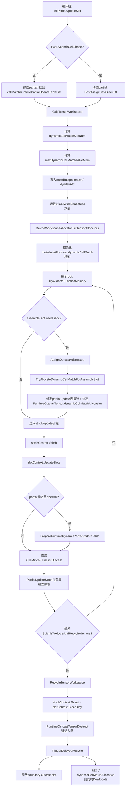
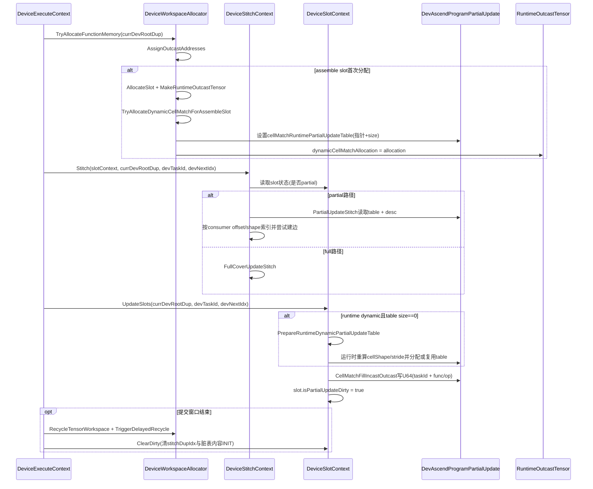

# 动态 Tensor Partial Cell Match：生命周期与代码修改说明

本文按 **编译期准备 → 运行时创建与初始化 → 任务结束回收** 的顺序，梳理当前实现中（**不含调试日志**）与动态 partial cell match table 相关的逻辑、前后顺序与计算方式，并标注与「仅静态表」路径的差异。

---

## 0. 总览：谁在什么时候动这张表

| 阶段 | 位置 | 作用 |
|------|------|------|
| 编译期 / 程序镜像填充 | `dev_encode.cpp` `DevAscendProgram::InitPartialUpdateSlot` | 区分静态 / 动态 partial：静态把表放进 `cellMatchRuntimePartialUpdateTableList`；动态 `HostAssignDataSize(0,0)` 不占编译期表体 |
| 编译期 | `dev_encode.cpp` `CalcTensorWorkspace` | 统计 `dynamicCellMatchSlotNum`、`maxDynamicCellMatchTableMem`（符号或常量上界），写入 `memBudget.tensor` 并写入 `DyndevFunctionAttribute` |
| Launch / GetWorkSpaceSize | `device_launcher_binding.h`、`runtime.cpp` | 用输入输出张量求值，把符号上界落到 `devProg->memBudget.tensor.maxDynamicCellMatchTableMem` 等，再算 `memBudget.Total()` |
| 运行时 workspace 初始化 | `dev_workspace.h` `Init` → `InitTensorAllocators` | 为 `metadataAllocators_.dynamicCellMatch` 划 `WsSlotAllocator` 池（slot 数 × 并行 × 每 slot 字节） |
| 每个 dup 分配 | `dev_workspace.h` `TryAllocateFunctionMemory` → `AssignOutcastAddresses` | Assemble 槽首次分配时，可对 **partial + 表仍空** 的路径调用 `TryAllocateDynamicCellMatchForAssembleSlot`：分配 slot、写 `partialUpdate` 向量、把 allocation 绑到 `RuntimeOutcastTensor` |
| 每次 stitch 后 | `device_slot_context.cpp` `UpdateSlots` → `UpdateSlotsForStitch` | 若 `size==0 && dim>0` 走 `PrepareRuntimeDynamicPartialUpdateTable`（与上类似）；然后 `CellMatchFillIncastOutcast` 写 U64 表项 |
| Stitch 消费 | `device_stitch_context.cpp` `PartialUpdateStitch` | 读同一 `partialUpdate` 的 `desc` + 表，按 consumer offset/shape 索引，满足条件则 `HandleOneStitch` |
| 提交 devtask 窗口后 | `device_execute_context.cpp` `SubmitToAicoreAndRecycleMemory` | `RecycleTensorWorkspace` → `stitchContext.Reset` → **`slotContext.ClearDirty`** |
| 边界 outcast 析构延迟回收 | `dev_workspace.h` `TriggerDelayedRecycle` | 释放 assemble 对应 boundary slot；若 `RuntimeOutcastTensor` 上挂了 `dynamicCellMatchAllocation`，同时 `dynamicCellMatch.Deallocate` |

---

## 1. 编译期准备

### 1.1 动态 cell shape 的判定

`HasDynamicCellShape`：`DevCellMatchTableDesc` 任一维 `cellShape <= 0` 即视为动态（编译期无法用静态维数推出表大小）。

### 1.2 `InitPartialUpdateSlot`（`dev_encode.cpp`）

**顺序：**

1. `partialUpdateList` 按 `slotSize` 做 `HostInitDataSizeOffset`。
2. **`ONFILLCONTENT`**：对每个 partial 槽位做**安全初始化**（避免 ABI/未初始化读）：  
   `cellMatchTableDesc` 置空 shape/stride；`cellMatchRuntimePartialUpdateTable.HostAssignDataSize(0, 0)`。
3. `cellMatchRuntimePartialUpdateTableList` 先 `HostInitDataSizeOffset(..., 0)`，再按各 slot 累加静态表总元素数 `totalCellMatchSize`。
4. 对每个 `tPartialUpdateSlotIndexList` 中的 slot：
   - `InitPartialUpdateCellMatch` 得到 `partialUpdateCellMatchTableDesc`；
   - `tableSize = partialUpdateCellMatchTableDesc.GetStride(0)`（与原先静态 stride 推导一致）；
   - **`ONFILLCONTENT`**：
     - **非动态 cell**：`partialUpdate.cellMatchRuntimePartialUpdateTable.HostAssignRangeOffsetSize(cellMatchRuntimePartialUpdateTableList, totalCellMatchSize, tableSize)`，并把表元素置为 `AICORE_TASK_INIT`；
     - **动态 cell**：`HostAssignDataSize(0, 0)` —— **不在** `cellMatchRuntimePartialUpdateTableList` 里占编译期连续数组空间。
   - 仅非动态时 `totalCellMatchSize += tableSize`。
5. 最后对 `totalCellMatchSize` 做对齐后，`cellMatchRuntimePartialUpdateTableList.HostInitDataSizeOffset(initOffset, totalCellMatchSize)`。

**与原先差异要点：** 动态 partial **不再**把 U64 表绑进 `cellMatchRuntimePartialUpdateTableList`；描述子 `cellMatchTableDesc` 仍写入 `partialUpdateList[slot]`，供运行时用表达式求真实 raw shape 后再算 `runtimeCellShape` / `strideShape` / `tableSize`。

### 1.3 `memBudget.tensor` 与 `DyndevFunctionAttribute`（`dev_encode_program.h`、`dev_encode.cpp`）

- `memBudget.tensor` 新增字段：
  - `maxDynamicCellMatchTableMem`：单张动态表字节上界（与 `SymbolicScalar` 链路衔接）；
  - `dynamicCellMatchSlotNum`：需要独立动态槽的 partial 个数估计。
- `Total()` 中增加项：`maxDynamicCellMatchTableMem * dynamicCellMatchSlotNum`（再与原有项一起做对齐与并行倍数）。

**`CalcTensorWorkspace` 中 `dynamicCellMatchSlotNum` 计算：**

遍历 `devProg.partialUpdateList`，条件为：

```text
partial.cellMatchRuntimePartialUpdateTable.size() == 0
&& partial.cellMatchTableDesc.GetDimensionSize() > 0
```

满足则计数 +1（表示「有 partial 语义、编译期无表体、但有维数」的运行时动态槽）。

**`maxDynamicCellMatchTableMem`（符号 `SymbolicScalar`）：**

- 若 `dynamicCellMatchSlotNum == 0`：置 `SymbolicScalar(0)`；
- 否则：`max(maxDynamicAssembleOutcastMem, max(maxStaticOutcastMem, 4096))` —— 用动态 assemble 与静态 outcast 的保守上界兜底单表最大字节需求。

编码收尾处（`dev_encode.cpp` 约 2770 行）：把 `tensorWsRes.maxDynamicCellMatchTableMem` 写入 `func->GetDyndevAttribute()->maxDynamicCellMatchTableMem`，供 **GetWorkSpaceSize / launch** 阶段用输入输出求值。

### 1.4 元数据侧 allocator 声明（`allocators.h`）

`MetadataAllocator` 增加成员 `WsSlotAllocator dynamicCellMatch`，与 `general` / slab 并列，专管动态 cell match 的 slot 池（小对象头块仍由 `general` 分配，与现有 `WsSlotAllocator` 模式一致）。

---

## 2. 运行时：Launch / Workspace 大小（与编译期衔接）

### 2.1 `GetWorkSpaceSize`（`device_launcher_binding.h`、对称的 `runtime.cpp`）

在已有对 `maxDynamicAssembleOutcastMem` 的求值之后，增加：

- `devProg->memBudget.tensor.maxDynamicCellMatchTableMem = eval.Evaluate(dynAttr->maxDynamicCellMatchTableMem)`；

然后返回 `devProg->memBudget.Total()`。这样 **launch 前** `DevAscendProgram` 内存预算里的动态表上界与真实输入输出一致，workspace 总大小包含动态 cell match 池。

---

## 3. 运行时：Workspace 初始化（池创建，非单表内容）

`DeviceWorkspaceAllocator::InitTensorAllocators`（`dev_workspace.h`）在 boundary outcast 池之后：

1. 读取 `devProg->memBudget.tensor.dynamicCellMatchSlotNum`；若为 0，则 **再扫一遍** `partialUpdateList`，用与 `CalcTensorWorkspace` 相同的条件累加（编译期漏写时的兜底）。
2. `dynamicCellMatchSlotBytes = memBudget.tensor.maxDynamicCellMatchTableMem`；若 slot 数非 0 但字节为 0，则 `max(MaxOutcastMem(), 4096)`。
3. `dynamicCellMatchBudget = dynamicCellMatchSlotNum * dynamicCellMatchSlotBytes`；
4. 若 `dynamicCellMatchSlotNum != 0`：`metadataAllocators_.dynamicCellMatch.InitTensorAllocator(baseAddr, dynamicCellMatchSlotNum * parallelism, dynamicCellMatchSlotBytes, metadataAllocators_.general)`，并推进 `baseAddr`。

**语义：** 这里初始化的是 **可复用的 slot 池**；单张表在运行时才 `Allocate()` 拿一个 slot 指针，大小不超过 `slotBytes`。

---

## 4. 运行时：单张表的创建与初始化（内容）

存在 **两条可能入口**（设计意图是互补，但顺序上比原版多一条）：

### 4.1 入口 A：`AssignOutcastAddresses` — Assemble 首次分配（`dev_workspace.h`）

**触发条件：** `outputSlotIndex == -1` 且 `assembleSlotIndex != -1`，且 `slotList[assembleSlotIndex].isAssembleSlotNeedAlloc == true`。

**顺序：**

1. `RuntimeOutcastTensorDerefSafe` 旧 assemble 的 `rtOutcastIter`；
2. `MakeRuntimeOutcastTensor(AllocateSlot(...), BOUNDARY_OUTCAST)` —— assemble **数据**张量；
3. **`TryAllocateDynamicCellMatchForAssembleSlot(devRootSrc, GetOutcast(i), expressionList, slot)`**  
   - 要求：`slot.isPartialUpdateStitch && slot.partialUpdate != nullptr`；
   - `dim <= 0` 或 **表已有 `Data()!=nullptr && size!=0`** 则直接返回（避免重复建）；
   - 必须有 `HasDynamicCellMatchSlots()`；
   - 从 `outcast.producerList` 或 `stitchPolicyFullCoverProducerList` 取 `useList`，对每个 use `GetTensorRawShape` 得 `rawShape`，逐维 `tensorShape[d] = max(..., rawShape[d])`；
   - 从高维到低维：`runtimeCellShape[d] = originalCell>0 ? originalCell : 1`，`tile = ceil(tensorShape[d]/runtimeCellShape[d])`，`strideShape[d]=tile`，`tableSize *= tile`；
   - 写回 `desc.SetCellShape/SetStrideShape`；
   - `requiredBytes = tableSize * sizeof(uint64_t)`，校验 `IsValidDynamicCellMatchMemRequirement`；
   - `AllocateDynamicCellMatchSlot()`，`DevRelocVector<uint64_t>(tableSize, ptr)`，整表置 `AICORE_TASK_INIT`；
   - `GetRuntimeOutcastTensor(slot.rtOutcastIter).dynamicCellMatchAllocation = dynamicCellMatchAlloc` —— **把 cell 表 allocation 绑在 assemble 对应的 boundary `RuntimeOutcastTensor` 上**，便于与 assemble 张量同生命周期回收。

4. `isAssembleSlotNeedAlloc = false`。

### 4.2 入口 B：`UpdateSlotsForStitch` — 动态且表仍空（`device_slot_context.cpp`）

**触发条件：** `slot.isPartialUpdateStitch`，且

```text
cellMatchRuntimePartialUpdateTable.size() == 0
&& cellMatchTableDesc.GetDimensionSize() > 0
```

则调用 **`PrepareRuntimeDynamicPartialUpdateTable`**（匿名命名空间内，逻辑与 4.1 中「算 rawShape → tableSize → 分配/HostAssignDataSize → 清零」**同构**；若 allocator 未初始化则提前返回；无 producer 时把表置空等）。

随后无论表来自 A 还是 B：

- `CellMatchFillIncastOutcast<false>(..., cellMatchTableDesc, tableData, devTaskId, devNextIdx)` 写入 **U64**：  
  `(uint64_t)devTaskId << TASKID_SHIFT32 | MakeTaskID(funcIdx, operationIdx)`（与 `dev_encode_function_stitch.h` 中原 partial 填充语义一致）；
- `slot.isPartialUpdateDirty = true`。

### 4.3 Slot 与 `partialUpdate` 指针（`device_slot_context.cpp` `FillInputOutputSlot`）

对每个 `partialUpdateList[index]`：

- `hasPartialUpdateTable = !partialUpdate.Empty()`（静态表路径）；
- `isRuntimeDynamicPartialUpdate = (size==0 && dim>0)`；
- **二者之一为真**则 `isPartialUpdateStitch = true` 且 `partialUpdate = &partialUpdate`。

这样 **动态 partial 无编译期表体** 时仍能标记为 partial stitch slot，后续 A/B 入口才能工作。

---

## 5. 运行时：Stitch 消费（读表建边）

`DeviceStitchContext::PartialUpdateStitch`（`device_stitch_context.cpp`）：

- 使用 **当前** `slot.partialUpdate->cellMatchTableDesc` 与 `cellMatchRuntimePartialUpdateTable[0]` 作为 `CellMatchHandle` 的索引空间；
- 对每个 consumer，`GetTensorOffsetAndShape` 后 `CellMatchHandle` 回调中读取 `cellMatchTableData[index]`；
- **当前实现中的判定**（相对「仅判断 id != INIT」的更强约束）：  
  `id != AICORE_TASK_INIT` **且** `(uint32_t)(id >> TASKID_SHIFT32) == devTaskId` 才消费；  
  再解析 `FuncID` / `TaskID`，并校验 `funcId < stitchingSize`、`producerOperationIdx < GetOperationSize()`。

**说明：** 若需与历史版本「完全一致」，应以仓库中未改动的 `PartialUpdateStitch` 为准核对上述条件是否多出 `devTaskId` 与边界 `return`；本文仅描述**现状**。

---

## 6. 任务结束回收与清状态

### 6.1 提交 stitched 窗口（`device_execute_context.cpp` `SubmitToAicoreAndRecycleMemory`）

在 `BuildDeviceTaskData` 之后：

1. `stitchContext.RecycleTensorWorkspace()`；
2. `stitchContext.Reset()`；
3. **`slotContext.ClearDirty()`**。

### 6.2 `ClearDirty`（`device_slot_context.cpp`）

- 所有 slot：`stitchDupIdx = INVALID_STITCH_IDX`；
- 若 `isPartialUpdateDirty && partialUpdate != nullptr`：对 `cellMatchRuntimePartialUpdateTable` 每个元素写 **`AICORE_TASK_INIT`**，并 `isPartialUpdateDirty = false`。

**语义：** 与「跨 devtask 不依赖 cell match 残留」一致时，避免下一段 stitch 窗口读到上一窗口的表内容；代价是**下一窗口首段 stitch 若仍依赖同一张逻辑表上的历史写入**，需在本窗口内再次 `UpdateSlots` 填满。

### 6.3 提前提交门控（`device_execute_context.cpp` `CallRootFunctionStitch`）

在 `AiCoreFree()` 触发 `SubmitToAicoreAndRecycleMemory` 时增加条件：**`!slotContext.HasDirtyPartialUpdate()`** 才允许因 AICore 空闲提前提交。`HasDirtyPartialUpdate` 扫描 slot 的 `isPartialUpdateDirty`。

**语义：** 试图减少「partial 表刚写完就被提交清空」的频率；是否与原版完全一致取决于原版是否仅有 `AiCoreFree()` 而无此 guard。

### 6.4 Boundary outcast 与动态表 slot 的物理回收（`dev_workspace.h`）

- `RuntimeOutcastTensorDestruct`：对 `BOUNDARY_OUTCAST` 推入 `rtBoundaryOutcastToBeFree_`；
- `TriggerDelayedRecycle`：对每个待释放项 `devTaskBoundaryOutcasts.Deallocate(allocation.ptr)`；若 **`dynamicCellMatchAllocation.ptr != 0`**，再 **`metadataAllocators_.dynamicCellMatch.Deallocate`**。

**顺序：** assemble 张量 boundary 释放与动态 cell 表释放发生在同一次 delayed recycle，与「表挂在 `RuntimeOutcastTensor` 上」的设计一致。

---

## 7. 其它结构体与 ABI 相关

- `RuntimeOutcastTensor`（`runtime_outcast_tensor.h`）增加 `WsAllocation dynamicCellMatchAllocation{}`，仅用于 **assemble 路径绑定的动态表** 回收；默认零表示无绑定。
- `DyndevFunctionAttribute`（`function.h`）增加 `SymbolicScalar maxDynamicCellMatchTableMem`，与 `memBudget` / evaluator 对齐。

---

## 8. 小结：与「编译期表 + 仅 UpdateSlots 填充」相比的差异清单

1. **编译期**：动态 partial **不占** `cellMatchRuntimePartialUpdateTableList` 连续区；`ONFILLCONTENT` 全槽位清零初始化。
2. **预算**：`memBudget` / `DyndevFunctionAttribute` / `GetWorkSpaceSize` 增加动态表池项。
3. **运行时池**：`MetadataAllocator::dynamicCellMatch` + `InitTensorAllocators` 划池；可选运行时重扫 `partialUpdateList` 补 slot 数。
4. **建表**：除 `UpdateSlots` 外，增加 **Assemble 首次分配** 上的 `TryAllocateDynamicCellMatchForAssembleSlot`；计算方式与 `PrepareRuntimeDynamicPartialUpdateTable` 同构（rawShape → tile → tableSize → 字节校验 → 分配 → INIT）。
5. **回收**：delayed recycle 释放 boundary + 可选 `dynamicCellMatch`；`ClearDirty` 整表 INIT；可选 `HasDirtyPartialUpdate` 影响提前提交。
6. **Stitch**：`PartialUpdateStitch` 增加 **devTaskId 高 32 位匹配** 与 **funcId / op 边界** 校验（现状）。

---

## 9. 文档维护

- 代码以仓库当前版本为准；若后续合并为「单入口建表」或回滚 stitch 条件，应同步更新本文第 4、5、6 节。

---

## 10. 流程图（全局与局部）

### 10.1 全局流程图：编译期到回收



### 10.2 局部流程图：单次 root 的 stitch / update / partial 表读写


