# Flash Attention Optimization Summary

## Scope

This document records the verified optimization path for the PyPTO flash attention forward kernel at:

- `models/experimental/ops-transformer/flash_attention_score/flash_attention_score_impl.py`

Target workload:

- Real model preset: `aigcode_8b_jamba_gdn_moe`
- Attention shape: `Q/K/V = [B, 32, S, 128]`
- Real benchmark target: `B=1, H=32, S=8192, D=128, causal`

## Optimization Map

```mermaid
flowchart LR
    A[Align to 8B real shape] --> B[Fix long-seq correctness\nmove q_block loop to Python wrapper]
    B --> C[Profile real 8B path\nQ=128 KV=128]
    C --> D[Symptoms\nBubble 85.86%\nTasks 12288]
    D --> E[Conclusion\nMain cost is excessive q-block launch fragmentation]
    E --> F[Increase q_block on the stable path]
    F --> G[Q=2048\nBubble 51.75%\nForward 375.659 ms]
    G --> H[Q=4096\nForward 223.492 ms]
    H --> I[Q=8192\nBubble 10.80%\nForward 169.533 ms]
    I --> J[Current best route\nUse real 8B query block directly]
```



## Problem Icon

```text
   +-----------------------+
   |  FlashAttention 8B    |
   |  real shape aligned   |
   +-----------+-----------+
               |
               v
        +-------------------+
        | Bubble high       |
        | q_block too small |
        +---------+---------+
               |
               v
      +-------------------------+
      | Reduce wrapper launches |
      | enlarge q_block         |
      +-----------+-------------+
                |
                v
      +-------------------------+
      | Q=8192 wins on 8B       |
      | full-shape steady 169ms |
      +-----------+-------------+
                |
                v
      +-------------------------+
      | Remaining bottleneck    |
      | device-side dependency  |
      +-------------------------+
```

## Verified Findings

### 1. Real model alignment

- The active target is the 8B MoE script:
  - `/sharedata/llx/pto/Mindspeed-LLM/examples/mcore/qwen2/pretrain_aigcode_8b_4k_jamba_gdn_moe_cann850_tpe.sh`
- Real attention dimensions from that script are:
  - `B=1`
  - `H=32`
  - `D=128`
  - `S=8192`
  - `mask=causal`

### 2. Current best stable route

Current default configuration in code:

- `Q block = 8192` for `aigcode_8b_jamba_gdn_moe`
- `KV block = 128`
- `QK cube tile = (128,128) / (64,256) / (256,256)`
- `PV cube tile = (128,128) / (128,512) / (128,128)`
- `vec tile = (128,256)`

### 3. What materially improved

Verified full-shape steady-state forward timing on the same stable codebase:

| Q block | Full shape steady-state forward |
|---------|---------------------------------|
| 128 | `4296.957 ms` |
| 256 | `2263.673 ms` |
| 512 | `1191.296 ms` |
| 1024 | `637.811 ms` |
| 2048 | `375.659 ms` |
| 4096 | `223.492 ms` |
| 8192 | `169.533 ms` |

Verified single-kernel bubble reduction on the same training-like path:

| Q block | Output dir | End-to-End Time | Avg Util | Avg Bubble |
|---------|------------|-----------------|----------|------------|
| 128 | `output/output_20260402_200918_588371_3018564_C0A890D9` | `68473.44 us` | `1.72%` | `85.86%` |
| 256 | `output/output_20260402_201210_746093_3022459_C0A890D9` | `69639.04 us` | `3.06%` | `79.16%` |
| 1024 | `output/output_20260402_201623_101084_3030660_C0A890D9` | `79097.04 us` | `10.39%` | `66.33%` |
| 2048 | `output/output_20260402_201903_168812_3034926_C0A890D9` | `94351.66 us` | `19.44%` | `51.75%` |
| 8192 | `output/output_20260402_202451_519913_3042750_C0A890D9` | `168666.34 us` | `57.19%` | `10.80%` |

### 4. Why it improved

The key change was not host-side scheduling knobs. The key change was reducing wrapper-side `q_block` fragmentation.

Direct evidence:

- `Q=128` on the real 8B path produced `85.86%` average bubble and `4296.957 ms` full-shape forward
- `Q=8192` reduced full-shape forward to `169.533 ms`
- the same `Q=8192` route reduced average bubble to `10.80%` and raised average utilization to `57.19%`

This matches the performance change:

- fewer wrapper launches
- much higher average utilization
- much lower bubble rate

## Attempts That Did Not Survive

These were tested and intentionally not kept as defaults:

- `combine_axis + sg_set_scope + semantic_label`
  - Broke `S=128` with AICPU/AICore exceptions.
- `vec = 128,512`
  - Looked fast on `S=128`, but serial `S=64` validation hit device-side errors.
- `PV cube = (128,128) / (64,256) / (256,256)`
  - Triggered device-side errors in timing runs.
- `device_sched_mode=3`
  - Could lower wall time slightly in some earlier tests, but did not solve bubble structurally.
- `head loop unroll = [8,4,2,1]`
  - Passed `S=64`, but first compile stretched to multi-minute scale, so it is not acceptable as the default route.
- `combine_axis=True` on the current kernel
  - C++ leaf code changed from `EXPAND` to `BRCB`, and device time dropped to `63.80 us`.
  - But average bubble increased to `47.56%`, so it is not the best route if bubble reduction is the primary goal.
- `combine_axis=True + device_sched_mode=3`
  - Device time dropped further to `58.42 us`.
  - Bubble worsened further to `61.42%`, so this was also rejected.

## Source-Level Findings

After checking generated C++ and framework pass sources, two findings were confirmed:

- Current stable kernel is still structurally split into multiple KV-block leaf functions:
  - one query/input preparation stage
  - one QK matmul stage
  - one softmax/update vector stage
  - one PV matmul stage
  - one final update/writeback stage
- `combine_axis=True` works as documented:
  - it replaces several broadcast-heavy `EXPAND` operations with `BRCB`
  - this lowers device-side execution time
  - but on this kernel it also changes the schedule shape enough to increase overall bubble

Related source references used in this round:

- `docs/api/operation/pypto-experimental-set_operation_options.md`
- `docs/tutorials/debug/performance.md`
- `framework/src/passes/tensor_graph_pass/remove_redundant_reshape.cpp`
- `framework/src/passes/tile_graph_pass/graph_constraint/remove_unaligned_reshape_op.cpp`
- `framework/src/passes/pass_utils/merge_view_assemble_utils.cpp`

## Precision Boundary

Verified:

- `Q=8192`, `KV=8192`, `causal` passes on real NPU
- `max diff = 0.001953`

Current backward limitation remains:

- backward is still only validated for `seq_kv <= 128`
- this round only optimized the forward path for the real 8B shape

## Current Conclusion

The current best stable route is:

- for `aigcode_8b_jamba_gdn_moe`, use `Q=8192`, `KV=128`
- keep the current `QK/PV cube tile` defaults
- use `vec tile = 128,256`
- keep `KV unroll = 1`

This is a real improvement, but not the final state:

- full-shape forward is now down to `169.533 ms`
- single-kernel bubble on the real 8B path is down to `10.80%`
- the next real engineering task is reducing the remaining dependency-heavy wait time inside the now-large single kernel
