# Configuration Options

## `unroll_factor`
**Type:** `int`  
**Default Value:** `1`  
**Description:** Loop unrolling factor. Specifies the number of original loop iterations merged into a single iteration of the generated code.

| Value | Behavior                                                                                              |
| :---- | :---------------------------------------------------------------------------------------------------- |
| `1`   | Unrolling disabled (generates a standard loop).                                                       |
| `>1`  | The loop body is replicated the specified number of times to reduce loop control overhead.            |

> **Recommendation:** Tune this parameter based on the input data volume (original grid size). For example, given a grid configuration of **(32, 1, 1)**, setting the JIT parameter **`unroll_factor=16`** will result in a loop with 2 iterations (`(32 * 1 * 1) / 16`).

### Example

`unroll_factor=1`:

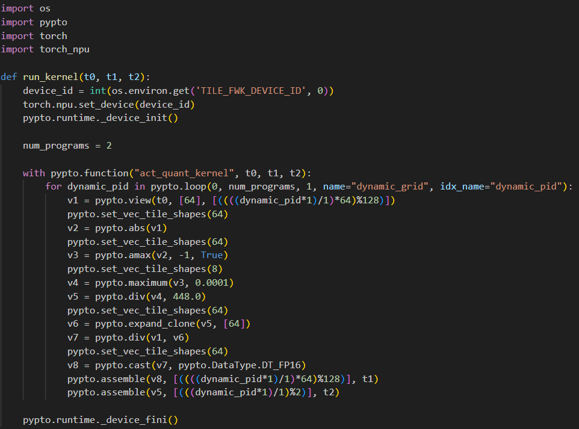

`unroll_factor=2`:

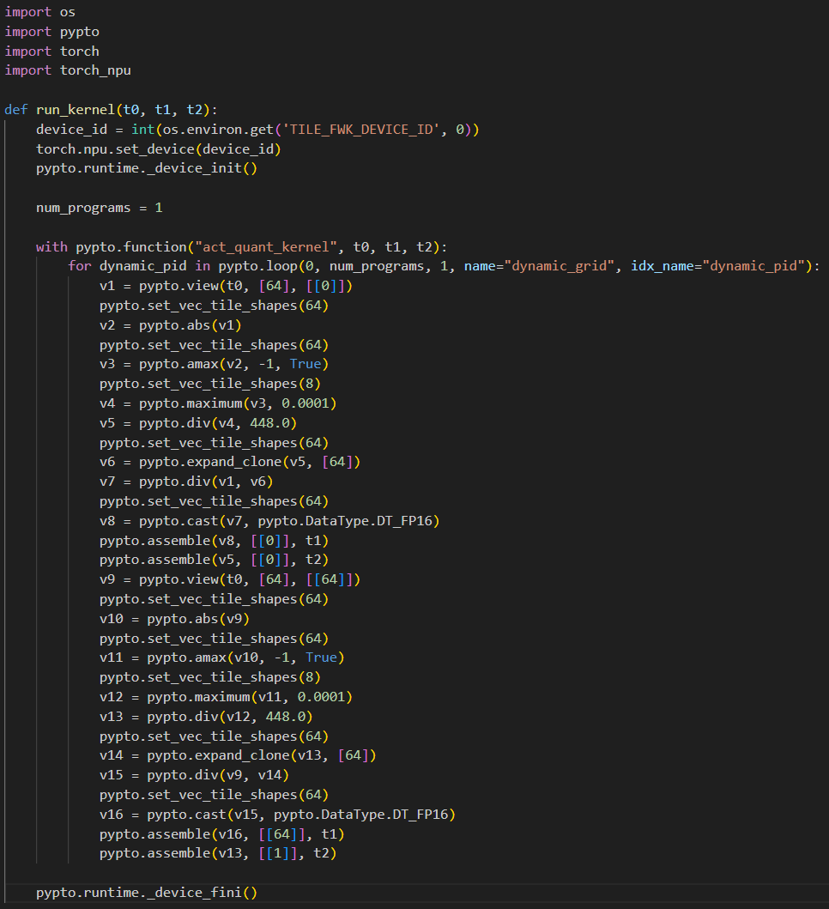

## `stitch_num`

**Type:** `int`  
**Valid Range:** `[1, 1024]`  
**Default Value:** `128`  
**Description:** Specifies the number of loop iterations that can be merged and executed in parallel within a single stitching operation. This parameter balances the degree of parallelism against scheduling and memory overhead.

| Value                | Behavior                                          | Performance Impact                                                                                          |
| :------------------- | :------------------------------------------------ | :---------------------------------------------------------------------------------------------------------- |
| `1`                  | Tasks execute sequentially, one after another.    | High synchronization overhead, low compute unit utilization.                                                |
| `128` (default)      | Multiple tasks are merged and executed in parallel. | Execution speedup with optimal scheduling and memory overhead.                                              |
| `>128`               | Increases the number of concurrently executing tasks. | May accelerate kernel execution but increases compilation/preparation time, memory consumption, and L2 cache pressure. |

> **Recommendation:**
> 1. Start with the default value (`128`).
> 2. If memory permits, gradually increase `stitch_num` while monitoring:
>    - **Total execution time** (preparation + execution)
>    - **Execution timelines (swimlane diagrams)** to assess parallelism
>    - **L2 cache efficiency**
> 3. Stop when further increases no longer reduce total execution time.

> **Warning:** Excessively high values (approaching `1024`) may cause:
> 4. Increased workspace memory consumption.
> 5. Degraded L2 cache efficiency due to excessive parallel task count.

#### Example: `stitch_num=32` (vector_add)

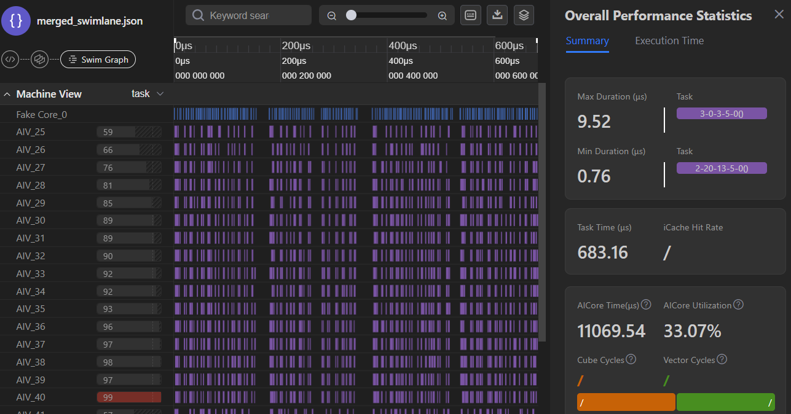

#### Example: `stitch_num=512` (vector_add)

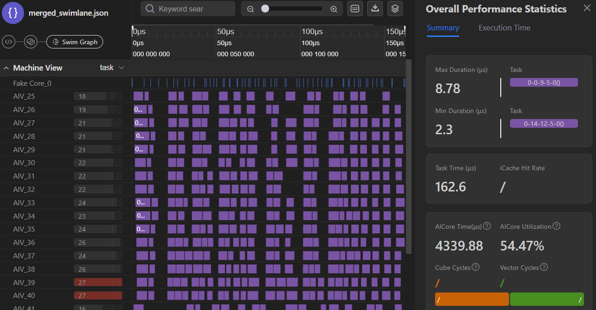

## `vec_merge_tasks`
**Type:** `dict[int, int]`  
**Default Value:** `{}`  
**Description:** Controls the merging degree of vector tasks across subgraphs with identical structures and data dependencies.

### Key & Value Format

| Key                | Value | Behavior                                                                                                                      |
| :----------------- | :---- | :---------------------------------------------------------------------------------------------------------------------------- |
| `-1`               | `1`   | Merging disabled for all subgraphs.                                                                                           |
| `-1`               | `N` (>1) | Manual merging: all subgraphs are grouped in batches of `N`.                                                                  |
| `0` … `N`          | `M` (>1) | Manual merging for a specific subgraph by index.                                                                              |
| `{}` (empty dict)  | —     | **Automatic mode:** merging degree is calculated automatically based on the number of available compute cores.                |

### Example

Consider 16 vector tasks with identical data dependencies:

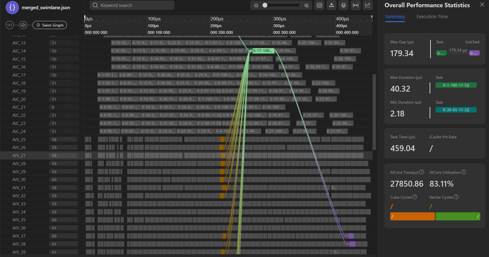

Applying a merge factor of 4 (`value={-1: 4}`) yields the following result:

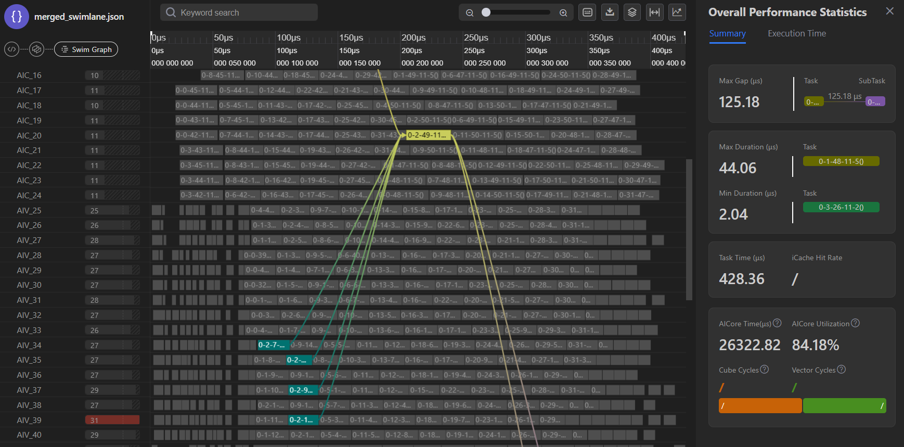

## `cube_merge_tasks`
**Type:** `dict[int, int]`  
**Default Value:** `{}`  
**Description:** Controls the merging degree of consecutive cube tasks across subgraphs with identical structures.

### Key & Value Format

| Key                | Value | Behavior                                                                                                                      |
| :----------------- | :---- | :---------------------------------------------------------------------------------------------------------------------------- |
| `-1`               | `1`   | Merging disabled for all subgraphs.                                                                                           |
| `-1`               | `N` (>1) | Manual merging: all subgraphs are grouped in batches of `N`.                                                                  |
| `0` … `N`          | `M` (>1) | Manual merging for a specific subgraph by index.                                                                              |
| `{}` (empty dict)  | —     | **Automatic mode:** merging degree is calculated automatically based on the number of available compute cores.                |
|                    |       |                                                                                                                               |

### Example
Result of automatic merging (`value={}`):

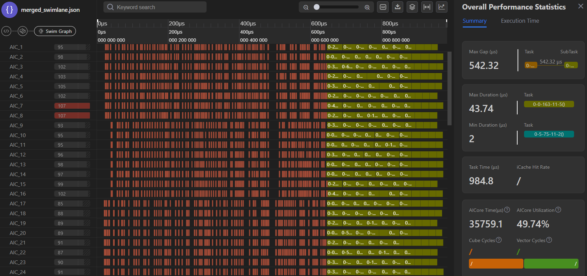

The output shows two subgraphs with identical consecutive tasks. To achieve optimal performance, set `value={0: 16, 1: 2}`:

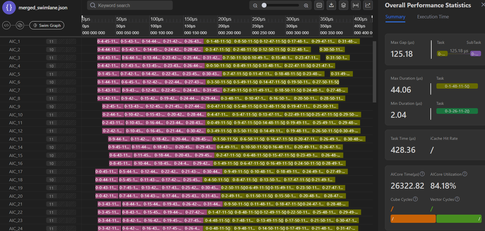

## `cube_l1_reuse`
**Type:** `dict[int, int]`  
**Default Value:** `{}`  
**Description:** Manages the merging of subgraphs exhibiting redundant L1 data transfers. This optimization groups subgraphs containing CUBE operations with identical data access patterns to prevent reloading the same data into the L1 cache.

### Key & Value Format

| Key                | Value | Behavior                                                                                                                                  |
| :----------------- | :---- | :---------------------------------------------------------------------------------------------------------------------------------------- |
| `-1`               | `1`   | Merging disabled for all subgraphs (each subgraph loads data into L1 independently).                                                      |
| `-1`               | `N` (>1) | Manual merging: all subgraphs are grouped in batches of `N` to share L1 data.                                                             |
| `0` … `N`          | `M` (>1) | Manual merging for a specific subgraph by index.                                                                                          |
| `{}` (empty dict)  | —     | **Automatic mode:** merging degree is calculated automatically based on the number of available compute cores (AIC cores).                |

### Example
Original swimlane diagram:

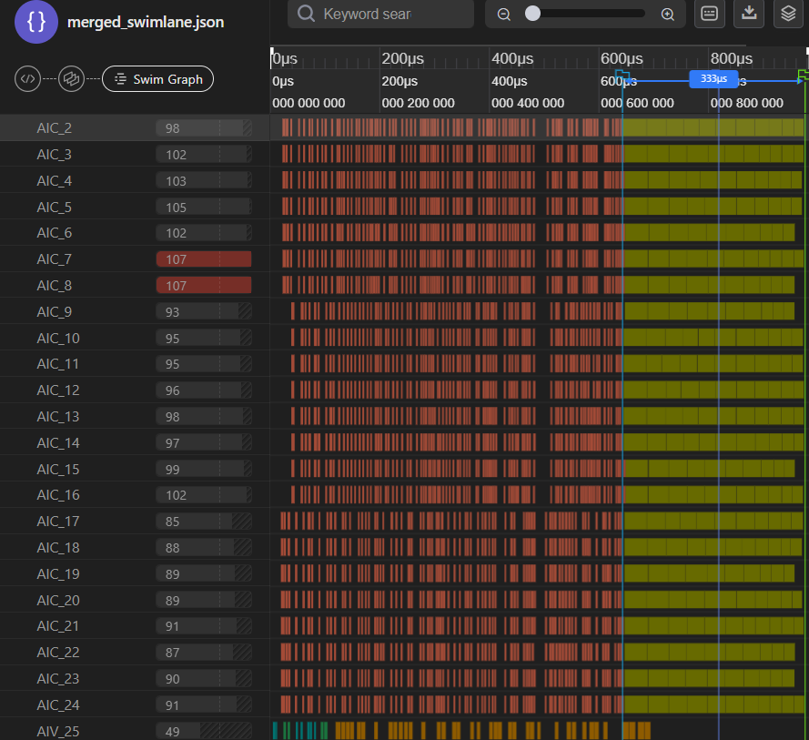

Merging tasks in groups of 4 (`value={-1: 4}`):

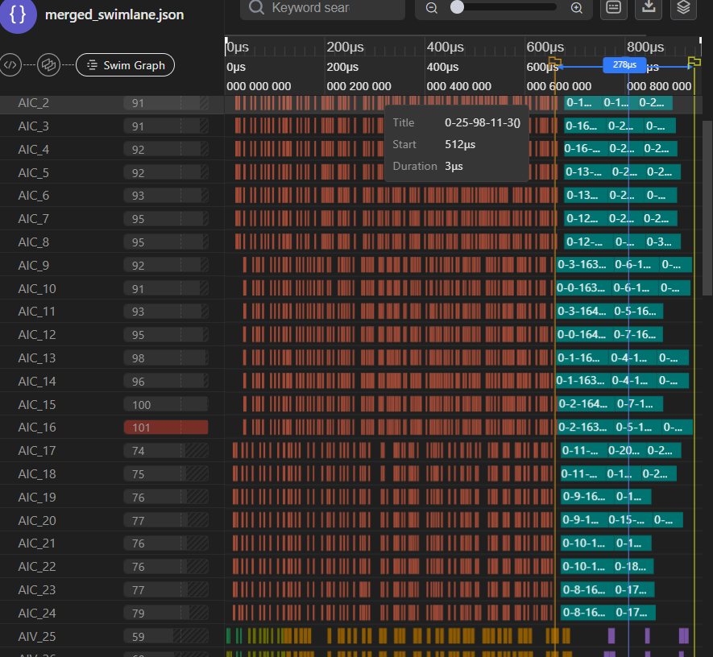

## `partition`
**Type:** `bool`  
**Default Value:** `True`  
**Description:** Controls whether a subgraph is partitioned into individual tasks.

| Value | Behavior                                             |
| :---- | :--------------------------------------------------- |
| `True`  | Standard subgraph partitioning into tasks is applied. |
| `False` | Partitioning is disabled.                            |

> **Recommendation:** Disabling partitioning is only recommended for **vector-only kernels** that do not contain **cube** tasks.

> **Warning:** While generally stable, setting this to `False` disables most PTO optimizations and may cause **undefined behavior** on **mixed kernels**.

### Example

**partition=True**

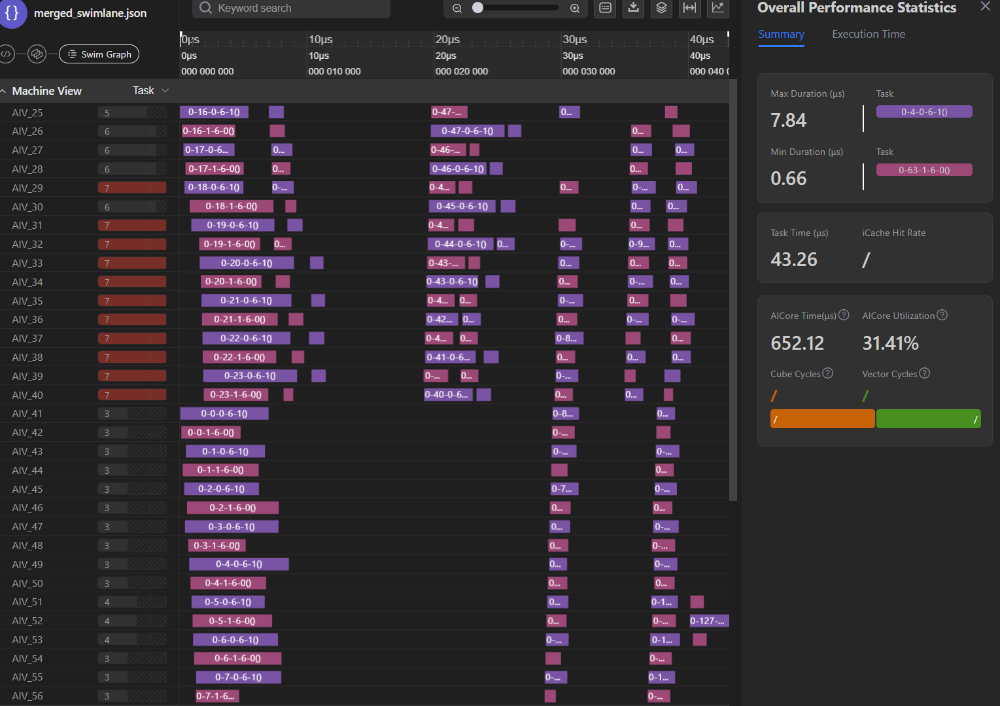

**partition=False**

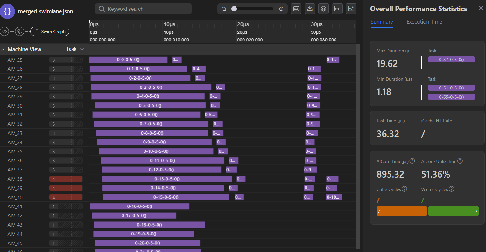

## `enable_auto_tiling`
**Type:** `bool`  
**Default Value:** `False`  
**Description:** Enables PTO auto-tiling optimization to automatically determine optimal tile sizes for **cube** and **vector** compute units.

| Value   | Behavior                                                                                     |
| :------ | :------------------------------------------------------------------------------------------- |
| `True`  | The system automatically selects optimal tile sizes for cube and vector blocks.              |
| `False` | Optimization disabled. Tile sizes are derived directly from the input PTO tensor dimensions. |

> **Recommendation:** For optimal performance, it is generally advised to use the largest feasible tensor sizes (e.g., by increasing the **`BLOCK_SIZE`** parameter), provided the original program semantics are preserved.
