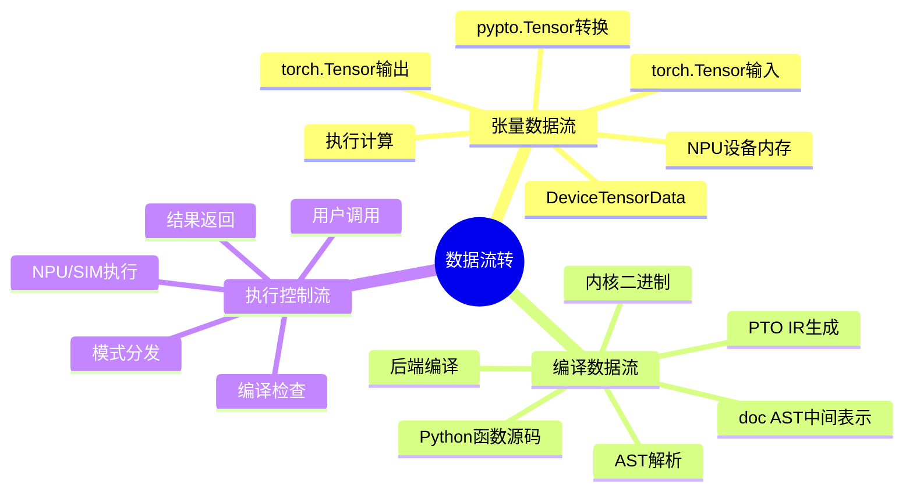

# PyPTO Hello World 代码流程思维导图

## Mermaid 思维导图

```mermaid
mindmap
  root((PyPTO Hello World<br/>代码流程))
    整体架构
      Python 前端层
        python/pypto/
        用户 API
        JIT 编译
        运行时执行
      C++ 框架层
        framework/
        底层运行时
        设备启动器
      示例层
        examples/
        用户代码示例
    阶段1: 程序入口和初始化
      命令行参数解析
        main()
        argparse 解析
        --run_mode
        --list
      设备ID获取
        get_device_id()
        环境变量 TILE_FWK_DEVICE_ID
        设备验证
      运行模式设置
        NPU模式
          需要CANN环境
          需要NPU硬件
        SIM模式
          模拟器模式
          无需硬件
    阶段2: 内核函数定义和装饰
      装饰器应用
        @pypto.frontend.jit()
        创建JitCallableWrapper
        延迟编译模式
        保存元数据
        不进行编译
      JitCallableWrapper类
        _original_func
        原始Python函数
        _pto_function
        编译后的PTO函数
        _is_compiled
        编译标志
        _runtime_options
        运行时选项
      关键代码路径
        entry.py::jit()
        entry.py::JitCallableWrapper.__init__()
    阶段3: 内核函数调用
      3.1 输入张量转换
        转换torch.Tensor
        转换为pypto.Tensor
        提取设备信息
        JitCallableWrapper.__call__()
      3.2 延迟编译
        创建解析器
        _create_parser()
        解析AST
        _parser.parse()
        活跃性分析
        初始化后端
        DeviceInit()
        OperatorBegin()
        设置配置选项
        _set_config_option()
        绑定动态维度
        bind_dynamic_dims_from_inputs()
        执行解析生成IR
        _parser.execute()
        后端编译
        OperatorEnd()
        编译过程详解
          AST解析
            Python函数转AST
            转换为doc AST
            活跃性分析
          IR生成
            访问AST节点
            生成PTO IR
            处理张量操作
            创建pypto.Function
          后端编译
            OperatorBegin()
            代码生成
            优化
            生成二进制
            OperatorEnd()
      3.3 输出张量分配
        从函数签名获取
        输出形状和类型
        分配输出张量
      3.4 运行时执行分发
        设置运行时调试模式
        _set_runtime_debug_mode()
        检查CANN环境
        ASCEND_HOME_PATH
        根据运行模式分发
        NPU模式
          _run_with_npu()
        SIM模式
          _run_with_cpu()
    阶段4: NPU模式执行
      4.1 NPU执行准备
        转换为设备张量数据
        _pto_to_tensor_data()
        设备切换
        torch.npu.set_device()
        _run_with_npu()
      4.2 工作空间分配和执行
        获取工作空间大小
        GetWorkSpaceSize()
        分配工作空间内存
        torch.empty()
        调用后端执行
        OperatorDeviceRunOnceDataFromDevice()
        错误检查
      4.3 C++层设备启动
        阶段0: 函数开始
        阶段1: 初始化和配置
          SetRunDataOption()
          KEY_RUNTYPE="npu"
        阶段2: 设置二进制数据
          SetBinData()
          kernelBinary
        阶段3: 设置捕获流
          SetCaptureStream()
          aicoreStream
          aicpuStream
        阶段4: 设置捕获模式
          SetCaptureFlag()
          SetProfFunction()
        阶段5: ACL初始化
          aclInit()
        阶段6: 缓存操作符处理
        阶段7: 检查设备ID
          CheckDeviceId()
        阶段8: 初始化Tiling数据
          DeviceInitTilingData()
          devProgBinary
        阶段9: 初始化内核输入输出
          DeviceInitKernelInOuts()
          inputList
          outputList
        阶段10: 注册内核二进制
          RegisterKernelBin()
        阶段11: 动态启动
          DynamicLaunch()
          aicpuStream
          aicoreStream
          blockdim
        阶段12: 性能分析运行
          RunWithProfile()
        阶段13: 流同步
          DynamicLaunchSynchronize()
    阶段5: SIM模式执行
      CPU模拟执行
        _run_with_cpu()
        成本模型接口
        _cost_model_run_once_data_from_host()
        无需NPU硬件
    阶段6: 结果验证
      准备输入数据
        torch.rand()
        随机数据生成
      执行内核
        create_add_kernel()()
        调用编译后的函数
      计算黄金值
        torch.add()
        CPU参考实现
      比较结果
        assert_allclose()
        容差检查
        rtol=3e-3
        atol=3e-3
    关键数据流
      张量数据流
        torch.Tensor
        pypto.Tensor
        DeviceTensorData
        NPU设备内存
        执行结果
        torch.Tensor返回
      编译流程
        Python函数
        @pypto.frontend.jit装饰器
        JitCallableWrapper
        首次调用时
          AST解析
          doc AST转换
          活跃性分析
          IR生成
          后端编译
        pypto.Function + handler
        可执行内核二进制
      执行流程
        用户调用
        JitCallableWrapper.__call__()
        编译检查
        输出张量分配
        运行模式分发
          NPU模式
          SIM模式
        结果返回
    关键类和接口
      Python层
        JitCallableWrapper
          entry.py
          JIT编译和执行包装器
        Parser
          parser.py
          AST到PTO IR解析器
        RunMode
          runtime.py
          运行模式枚举
      C++层
        DeviceLauncher
          device_launcher.cpp
          设备启动器
        DeviceRunner
          device_runner.cpp
          设备运行器
        Function
          framework/
          PTO函数表示
    配置选项
      运行时选项
        runtime_options
        run_mode
        RunMode.NPU
        RunMode.SIM
      代码生成选项
        codegen_options
        控制代码生成过程
      主机选项
        host_options
        控制主机端行为
      Pass选项
        pass_options
        控制编译器优化Pass
    错误处理
      编译时错误
        Parser Diagnostics系统
        源位置报告
      运行时错误
        后端返回错误消息
      设备错误
        检查CANN环境
        检查设备可用性
    性能优化特性
      延迟编译
        首次调用时才编译
        避免模块加载开销
      缓存机制
        相同输入形状复用
        编译结果缓存
      工作空间复用
        工作空间内存复用
      流异步执行
        异步执行支持
        流同步
```

## 简化版思维导图（核心流程）

```mermaid
mindmap
  root((Hello World<br/>执行流程))
    1. 程序入口
      main()
      参数解析
      设备ID获取
    2. 函数定义
      @pypto.frontend.jit装饰器
      JitCallableWrapper创建
      延迟编译
    3. 函数调用
      输入转换
      编译检查
      延迟编译触发
        AST解析
        IR生成
        后端编译
      输出分配
    4. 执行分发
      NPU模式
        设备准备
        工作空间分配
        C++层启动
          14个执行阶段
      SIM模式
        CPU模拟
        成本模型
    5. 结果验证
      黄金值计算
      结果比较
```

## 数据流思维导图



## 类关系思维导图

```mermaid
mindmap
  root((关键类))
    JitCallableWrapper
      职责
        JIT编译包装
        延迟编译管理
        运行时执行
      属性
        _original_func
        _pto_function
        _is_compiled
        _handler
        _parser
      方法
        __call__()
        _compile_if_needed()
        _dispatch_with_run_mode()
        _run_with_npu()
        _run_with_cpu()
    Parser
      职责
        AST解析
        IR生成
      方法
        parse()
        execute()
        bind_dynamic_dims_from_inputs()
    DeviceLauncher
      职责
        设备启动
        内核执行
      方法
        DeviceLaunchOnceWithDeviceTensorData()
        DeviceSynchronize()
    DeviceRunner
      职责
        设备资源管理
        内核注册
      方法
        DynamicLaunch()
        RegisterKernelBin()
```

## 使用说明

1. **Mermaid 支持**: 本思维导图使用 Mermaid 语法，可在以下环境中查看：
   - GitHub/GitLab (原生支持)
   - VS Code (安装 Mermaid 插件)
   - Typora、Obsidian 等 Markdown 编辑器
   - 在线工具: https://mermaid.live/

2. **查看方式**:
   - 在支持 Mermaid 的编辑器中直接查看渲染效果
   - 复制代码到 https://mermaid.live/ 在线查看
   - 使用 VS Code 的 Mermaid Preview 插件

3. **思维导图结构**:
   - 主思维导图：完整的代码流程
   - 简化版：核心流程概览
   - 数据流：数据流转过程
   - 类关系：关键类及其关系
